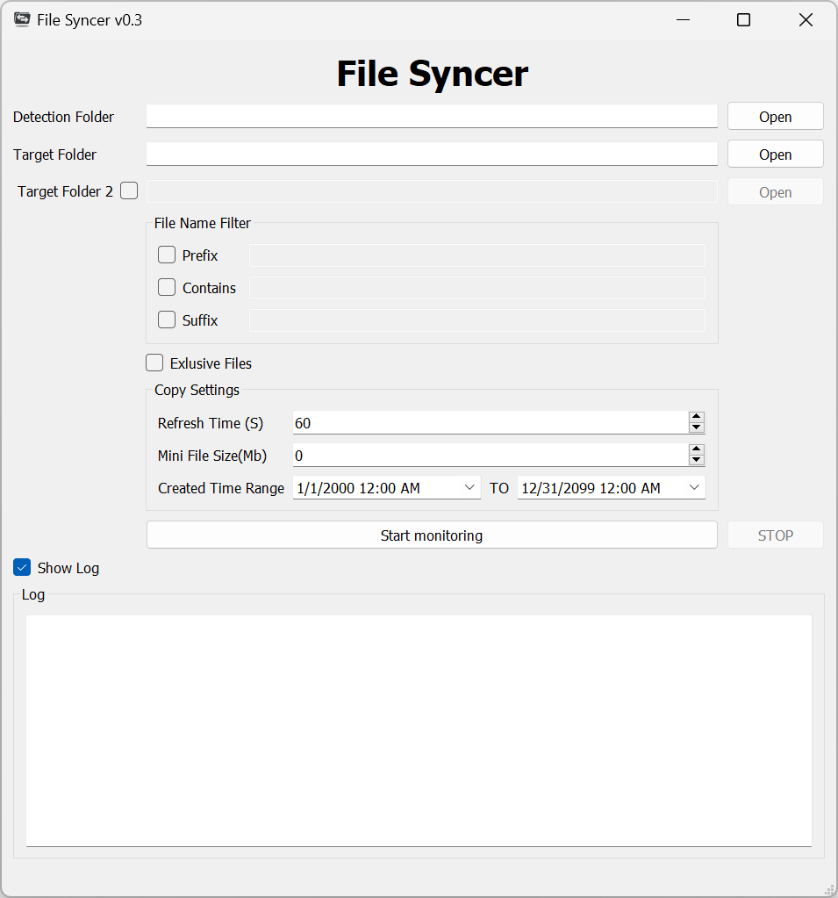

# File Syncer

File Syncer is an application designed for synchronizing files between a source directory and one or more target directories. It maintains the original directory structure and supports folder content synchronization. The application is built using PyQt5, providing a clean and user-friendly interface.

## Features

- Automatically syncs files from a source directory to target directories
- Supports synchronization of folders and their contents
- Maintains the original directory structure
- Supports file name filtering
- Real-time display of synchronization logs

### Requirements

- Python 3.6+
- PyQt5
- pywin32 (Windows only)

